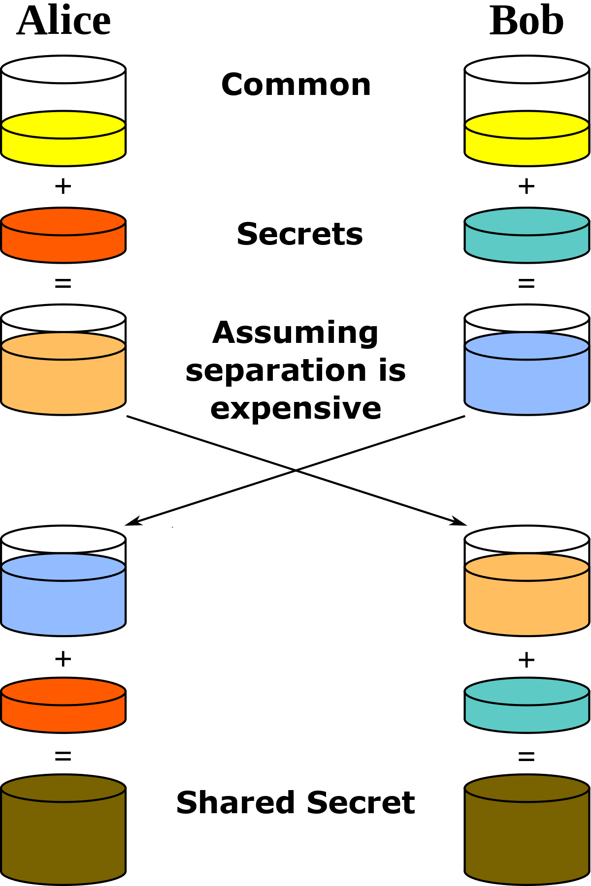

- # Finite Field Diffie-Hellman
	- The Diffie-Hellman Key Exchange is a mathematical method of securely creating a shared secret (most often a symmetric encryption key) between two clients over an insecure/public channel by using public and private variables.
	- This method is widely used such as in [[SSH]], [[TLS]], [[SSL]] and most end-to-end encryption protocols
	- ## Description
	- Given two parties, Alice and Bob, both of which have a secret component Alice -> a (orange), Bob -> b (cyan) and a common component c (yellow). For simplicity we use colours for this variables. Alice and Bob both create a mixture with their secret component and the public component and publish that mixture. Alice created the mixture `ac` and Bob created the mixture `bc`. They then exchange their mixture and add their secret to it to create the shared secret `abc`.
		- {:height 450, :width 300}
	- Using this method it is essential for both parties to never share their secrets without mixing it to guarantee they are the only ones who are able to create the shared secret.
	- ## Mathematics
		- Components
			- `s` -> secret random number between 1 and `p`
			- `g` -> generator [[primitive root modulo n]]
			- `p` -> prime number
		- The key exchange will look something like this:
			- Party A will select a random number a between 1 and `p`, calculate the value of base g to the power a modulo p, let’s call it `x`, and send it to party B.
				- ## $g^{a} mod(p)$
			- Party B will do similar steps: select a random number `b` between 1 and `p`, calculate the value of base g to the power b modulo p, let’s call it `y`, and send the result to party A.
				- ## $g^{b} mod(p)$
			- Upon receiving the value from B, party A will take that number `y` and raise it to power `a` modulo `p`. Similarly party B will take the number `x` and raise it to power `b` modulo `p`.
				- ## $g^{y^{a}} mod(p) = g^{x^{b}} mod(p)$
				- Since $x^b=g^{a^b}=g^{a·b}=g^{b·a}=gba=ya$ mod `p` both A and B get the same result without exchanging either `a` or `b` explicitly or a value that allows easy calculation of either `a` or `b`
		- Example with small numbers
			- Let `a = 15`, `b = 13`, `g = 3` and `p = 17`
			- Alice calculates:
				- ## $3^{15} mod(17) = 6$
			- Bob calculates:
				- ## $3^{13} mod(17) = 12$
			- `6` and `3` are shared publicly
			- Alice calculates their shared secret:
				- ## $3^{12*15} mod(17) = 10$
			- Bob calculates their shared secre:
				- ## $3^{6*13} mod(17) = 10$
- Source
	- https://www.redhat.com/en/blog/understanding-and-verifying-security-diffie-hellman-parameters
	- https://www.youtube.com/watch?v=NmM9HA2MQGI
	- https://www.youtube.com/watch?v=Yjrfm_oRO0w
	- https://en.wikipedia.org/wiki/Diffie%E2%80%93Hellman_key_exchange
-
-