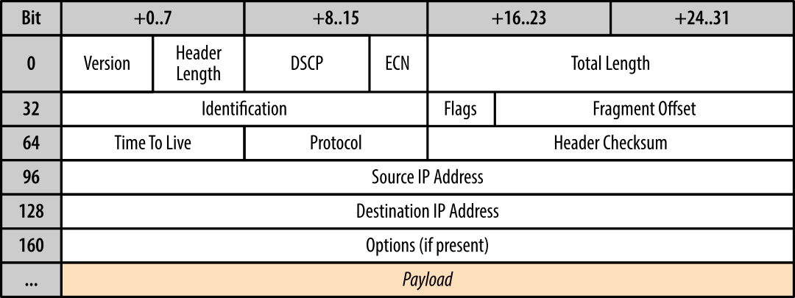

# Internet Protocol (IP)
	- Is a [network layer (layer 3)]( ((64412719-7dde-4652-ae30-ed9ed4768876)) ) communication protocol for relaying #Datagram across network boundaries.
	- This layer provides no guarantee about message delivery or notification of failure and hence directly exposes the unreliability to the layer above.
	- Each datagram is encapsulated within an IP packet which identifies the source and the destination addresses, as well as a number of other routing parameters.
	- ## RFC 791 - IPv4
		- 32 bit long addresses (maximum of 4.29 billion addresses). The problem here is that we run out of IP addresses if we want to give every device on the world a unique one. Because of that [[Network Address Translators (NAT)]] were introduced. The proposed IP reuse solution was to introduce NAT devices at the edge of the network, each of which would be responsible for maintaining a table mapping of local IP and port tuples to one or more globally unique (public) IP and port tuples The local IP address space behind the translator could then be reused among many different networks, thus solving the address depletion problem.
		- Each address consists of numbers (0-255) concatenated with dots -> 192.168.1.1
		- Instead of this dot-decimal representation you could use the compact CIDR notation. This specifies an IP address, a slash character and a decimal number. The decimal number is the count of consecutive leading 1-bits (from left to right) in the network mask.  The number can also be thought of as the width (in bits) of the network prefix.
		- ### Header
			- 
			  id:: 6464998d-c562-4cca-aa7f-f315c069593a
			-
		- ### Private network IP Ranges
			- | IP address range | Number of addresses |
			  |--------------------|-------------------------|
			  | 10.0.0.0 - 10.255.255.255 | 16'777'216 |
			  | 172.16.0.0 - 172.31.255.255 | 1'048'576 |
			  | 192.168.0.0 - 192.168.255.255 | 65'536 |
	- ## RFC 4291 - IPv6
		- Uses 128-bit addresses, allowing approximately 3.4×10E38 total addresses. This solves the problem of the IPv4 address shortage
		- Each address is represented by eight groups of four hexadecimal digits, separated by colons. If one groups consists of only zeros, it gets shortened -> 2001:0db8:0000:0000:0000:8a2e:0370:7334 becomes 2001:db8::8a2e:370:7334
		- One
		- IPv6 and IPv4 are running in a dual stack until IPv4 gets obsolete
		- IPv6 implements some features that are not present in IPv4
			- Simplified IP configuration
			- Multicast addresses
			- Address scopes
			- Multiple addresses per host
			- Faster routing
	-
- Source
	- https://hpbn.co/building-blocks-of-udp/
	- https://en.wikipedia.org/wiki/Internet_Protocol
- Tags
	- #computer-science