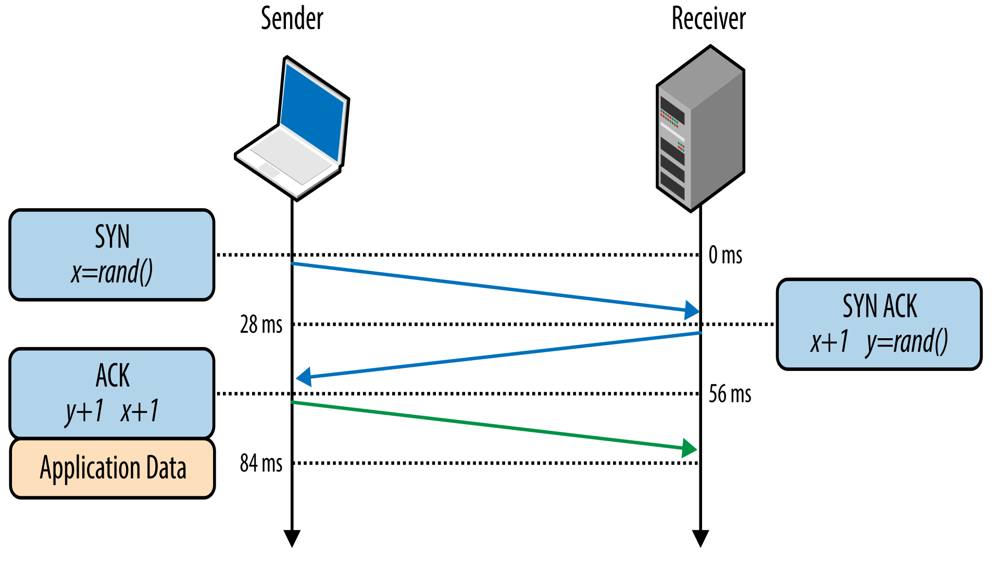
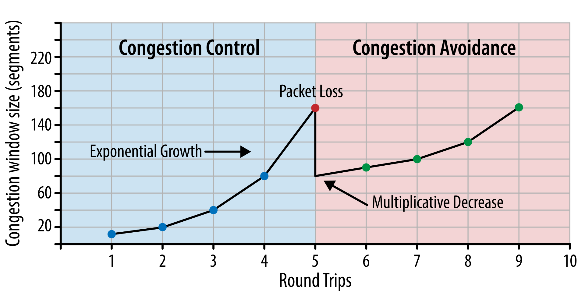
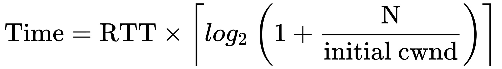
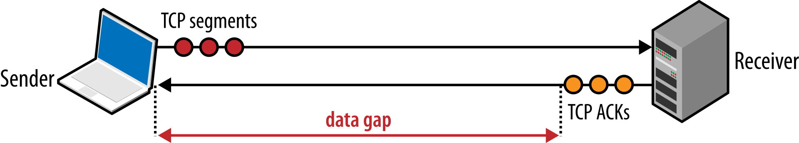

- # RFC 793 - Transmission Control Protocol (TCP)
	- TCP streams guarantee that all bytes sent will be identical with bytes received and that they will arrive in the same order to the client. TCP is optimised for accurate delivery rather than a timely one.
	- TCP is specifically designed to use packet loss as a feedback mechanism to help regulate its performance.
	- ## Handshake
	  collapsed:: true
		- TCP is using a three-way-handshake before sharing any application data
			- Client picks a random sequence number `x` and sends a **SYN** packet, which may also include additional TCP flags and options.
			- Server increments `x` by one, picks own random sequence number `y`, appends its own set of flags and options, and dispatches the response in a **SYN ACK** packet.
			- Client increments both `x` and `y` by one and completes the handshake by dispatching the last **ACK** packet in the handshake.
			- 
			- It is important to understand that when using TCP this handshake is made every time a new connection establishes and causes a full roundtrip of #latency before any application data can be transferred
	- ## TCP Header
	  collapsed:: true
		- ### Source Port (16 bits)
			- Specifies the port number of the sender
		- ### Destination Port (16 bits)
			- Specifies the port number of the receiver
		- ### Sequence Number (32 bits)
			- This is a unique number assigned to each packet by the sender to identify the order in which packets should be received by the receiver. The sequence number is used in conjunction with the acknowledgement number to ensure reliable data transfer and to prevent duplicate packets. It is initialized when a connection is first established
		- ### Acknowledgement Number (32 bits)
			- This is used to acknowledge the receipt of a TCP segment and to communicate the next expected sequence number to the sender. The acknowledgement number field contains the sequence number of the next expected segment when the ACK control flag is set.
		- ### Data Offset (4 bits)
			- This is used to tell the receiver how many 32-bit words (4 bytes each) are in the header, so it knows where the header ends and the data begins.
		- ### Reserved (4 bits)
			- For future use and should be set to zero.
		- ### Control Flags (8 bits, 1 bit each)
			- **Congestion window reduced (CWR)**: is set by the sending host to indicate that it received a TCP segment with the *ECE* flag set and had responded in congestion control mechanism
			- **Explicit Congestion Notification Echo (ECE)**: has two usages depending on the *SYN* flag
				- if *SYN = 0* the flag indicates that a packet with Congestion Experienced flag set (ECN=11) in the IP header was received during normal transmission
				- if *SYN = 1* the flag indicates that the TCP peer is #ECN capable
			- **Urgent (URG)** is used to indicate that the data contained in the Urgent Pointer field is significant and should be processed prioritized
			- **Acknowledgement (ACK)** is used to acknowledge packets which are successful received by the host. It indicates that the *Acknowledgement number* field is set.
			- **Push (PSH)** is used to request immediate data delivery to the receiving host, without waiting for additional data to be buffered on the sender’s side. This flag is commonly used in applications such as real-time audio or video streaming
			- **Reset (RST)** is used to terminate the connection if the sender feels something is wrong with the TCP connection or that the conversation should not exist
			- **Synchronization (SYN)** is used to establish the three-way-handshake. This is the first packet sent by each and synchronizes the sequence numbers
			- **Finish (FIN)** is used to request a graceful connection termination. This is the last packet sent.
			  id:: 64411fb2-0438-48ae-94a1-53f821a4fa28
		- ### (Receive) Window (16 bits)
			- Specifies how many window size units that the sender of this segment is currently willing to receive. The #RWND and the #CWND are used to regulate data flow.
		- ### Checksum (16 bits)
			- This is used to verify the integrity of the TCP segment during transmission. The checksum is computed over the entire segment, including the header and data fields, and is recalculated at each hop along the network path
		- ### Urgent Pointer (16 bits)
			- If the URG flag is set, then this 16-bit field is an offset from the sequence number indicating the last urgent data byte
		- ### Options (Variable 0–320 bits, in units of 32 bits)
			- The length is defined by the *data offset* field
			- Options can have up to 3 fields of which only the first one is mandatory
				- **Option-Kind (1 byte)**
				- **Option-Length (1 byte)**
				- **Option-Data (variable)**
			- | Option-Kind | Option-Length | Option-Data |                                 Purpose |                 only SYN |
			  |-------------------------------------------------------------------------------------------------------|
			  |                  0 |                       - |                   - |                  End of options list |                          |
			  |                  1 |                       0 |                   - |                          No operation |                          |
			  |                  2 |                       4 |                 SS |         Maximum segment size |             **SYN** |
			  |                  3 |                       3 |                   S |                        Window Scale |             **SYN** |
			  |                  4 |                       2 |                   - |         selective ACK permitted |             **SYN** |
			  |                  5 |  10, 18, 26 or 34 | BBBB, EEEE,... |             selective ACK (SACK) |                          |
			  |                  8 |                       - | TTTT, EEEE.     | timestamp and echo of previous timestamp |                          |
		- ### Padding (32 bit)
			- The TCP header padding is used to ensure that the TCP header ends, and data begins, on a 32-bit boundary. The padding is composed of zeros
	- ## Maximum Segment Size
		- #WIP
	- ## Selective Acknowledgments (SACK)
		- #WIP
	- ## Window Scaling
		- #WIP
	- ## Congestion handling
	  id:: 644125f5-6bd7-427e-b73d-e1fa640d0d88
	  collapsed:: true
		- When network traffic exceeds beyond the capacity of the network and causes increased delays, packet loss and decreased network performance it is called congestion. To address these issues, multiple mechanisms were implemented in TCP to govern the rate with which the data can be sent in both directions: flow control, congestion control, and congestion avoidance.
		- The maximum amount of unacknowledged, in-flight data between the sender and receiver is defined as the minimum of the receive and congestion window sizes: the current receive windows are communicated in every ACK, and the congestion window is dynamically adjusted by the sender based on the congestion control and avoidance algorithms.
		- ### Flow control
		  collapsed:: true
			- A mechanism to prevent the sender from overwhelming the receiver with data it may not be able to process as the receiver may be busy, under heavy load or may only allocate a fixed amount of buffer space. For this the Window segment is used when the first connection is established for both sender and receiver.
			- Each ACK packet carries the latest WND value for each side, allowing both sides to dynamically adjust the data flow rate to the capacity and processing speed of the sender and receiver.
		- ### Slow-start
		  id:: 64412696-09fb-49b5-b5de-f3d48f03232d
		  collapsed:: true
			- Even though flow control prevents the sender from overwhelming the receiver, it does not consider that the underlying network might be overloaded. This is the reason the slow start was added to TCP.
			- Slow start estimated the capacity of the network by exchanging data and start (what to expect) slowly. The maximum amount of data in flight (not ACKed) is the minimum of of the #[[RWND]] and #[[CWND]] variables. For every received **ACK**, the slow-start algorythm indicates that the server can increment its #[[CWND]] by one segment.
			- This image is a representation of the #[[AIMD]] algorythm.
			  
			- Time to reach the cwnd size of size N
			  
				-
			- Slow start is not as big of an issue for large, streaming downloads, as the client and the server will arrive at their maximum window sizes after few hundred milliseconds. For short and burst connections such as #HTTP, it is not unusual for the data transfer to finish before reaching the maximum size. Here performance can be increase by reducing the #RTT between the server and the client.
		- ### Slow-start Restart
		  collapsed:: true
			- This is a mechanism that will reset the #[[CWND]] size of a connection after it has been idle for a defined period of time. This is due to the fact that the condition of the underlying network might have changed while the connection has been idle.
			- This mechanism is a "safe" default. However, disabling this can gain performance on long-lived #HTTP connections.
		- ### Congestion Avoidance
		  collapsed:: true
			- Slow-start initializes the connection with a conservative window and, for every roundtrip, doubles the amount of data in flight until it exceeds the receiver’s flow-control window, a system-configured congestion threshold (ssthresh) window, or until a packet is lost, at which point the congestion avoidance algorithm takes over.
			- Once the congestion window is reset, congestion avoidance specifies its own [algorithms]( [[CCA]] ) for how to grow the window to minimize further loss. At a certain point, another packet loss event will occur, and the process will repeat once over.
	- ## Bandwidth-Delay Product
	  collapsed:: true
		- Product of data link’s capacity and its end-to-end delay. The result is the maximum amount of unacknowledged data that can be in flight at any point in time.
		- The built-in congestion control and avoidance mechanisms force the sender to stop after sending more than the amount of unacknowledged data there is defined. The sender then has to wait for an ACK some of the packets before proceeding. If the sender has frequently has to wait for the other end to send ACKs, this would create gaps in the data flow. That is why the receiver window sizes must vary based on the #RTT and the target data rate between the two ends.
		  
		-
		- Here is how to calculate the maximum data rate of a connection given the #RTT and minimum window size. In this example the window size is 16 KB and the roundtrip time is 100 ms
		  _1683725142032_0.png)
		  Even if the bandwidth is higher than 1.3 Mbps this connection would never exceed this data rate
		- To increase the optimal window size there needs to be an increase in either the roundtrip time or the window size. Assuming the underlying network is capable of a 10 Mbps bandwidth:
		  _1683725383195_0.png)