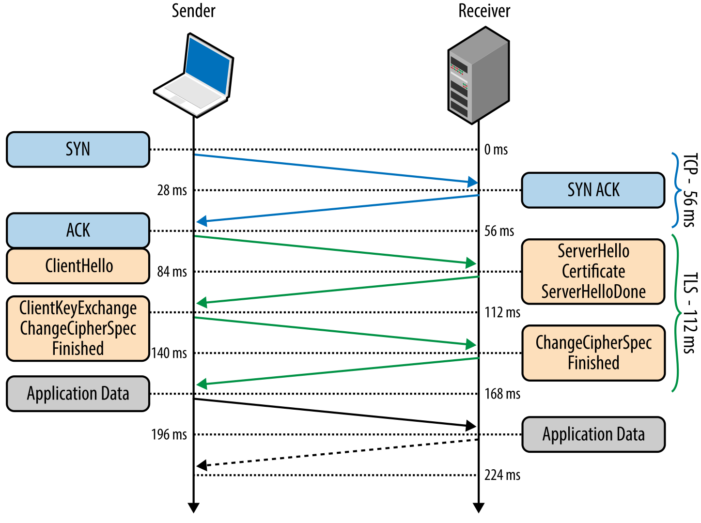

# RFC 2246 - Transport Layer Security (TLS)
	- TLS (formerly known as #SSL ) uses a combination of [[symmetric cryptography]] and [[asymmetric cryptography]] to provide a good compromise between performance and security when transmitting data securely. Third-party observers can only infer the connection endpoints, type of encryption, as well as the frequency and an approximate amount of data sent. but cannot read or modify any of the actual data.
	- TLS works on the [application layer]( ((645bb059-accb-4052-951b-6927d78a2919)) ), directly on top of #TCP. This enables protocols above it (HTTP, email, ...) to operate unchanged.
	- The protocol is designed to provide three essential services to all applications running above it:
		- Encryption (obfuscate sent data)
			- Both parties must agree which cipher will be used and the keys used to encrypt the data. This happens during the TLS handshake. Public key cryptography allows the peers to negotiate a shared secret key without having to to establish any prior knowledge of each other.
		- Authentication (verify validity of identification material)
			- This verification is based on the established chain of trust with the help of Certificate Authorities.
		- Integrity (detect tampering and forgery)
			- To each sent record, the result of a cryptographic hash function is appended (MAC). The receiver of the record is able to compute and verify the sent MAC value to ensure integrity and authenticity.
	- ## Handshake
		- 
			-
		- First, a [TCP three-way-handshake]( ((645b5d9e-0a16-4766-85b0-ac874fcea633)) ) is completed to establish a reliable connection
		- After that, the client sends its TLS specifications in plain text:
			- TLS version
			- Supported ciphersuites
			- TLS options
		- The receiver picks the TLS Version and the ciphersuite to continue, attaches its [[Digital certificate]]
- Source
	- https://hpbn.co/transport-layer-security-tls/
	- https://www.internetsociety.org/deploy360/tls/basics/
- Tags
	- #computer-science