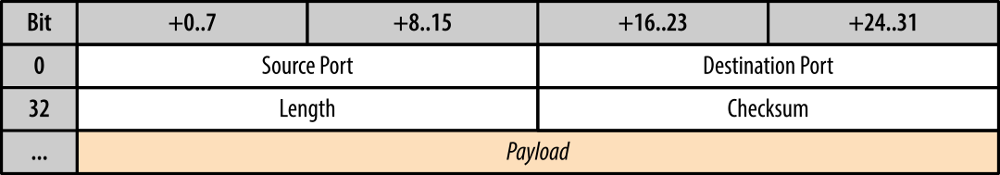

- # RFC 768 - User Datagram Protocol (UDP)
	- Also referred to as *null protocol*
	- In comparison to #TCP this protocol does **not** provide
		- guaranteed message delivery
		- ordered delivery
		- connection state tracking
		- congestion control
	- ## Header
		- This protocol delivers user messages in #datagram which are different to packets as they are not meant to be reliable.
		- UDP encapulates user messages into its own packet structure which adds four fields
		  
		- ### Source Port (optional)
			- Indicates the port of the sending process and may be assumed to be the port to which a reply should be addressed in the absence of any other information. If unused, zero is inserted.
		- ### Destination Port (optional)
			-
		- ### Length
		- ### Checksum (optional)
			- The #IP packet contains its own header checksum, and the application can choose to omit the UDP checksum, which means that all the error detection and error correction can be delegated to the applications above them.
		-
		-